# CGE comprehensive product and UX review

**Review date:** 8 August 2026  
**Product:** [PlayCGE.com](https://playcge.com/)  
**Scope:** Website, esports, marketplace and Swap, community, lounge booking, messaging, player profiles, trust and safety, accessibility, mobile experience, monetization, and cross-pillar strategy.

---

## Executive conclusion

CGE already has the right strategic shape: it is not merely a tournament site, classifieds site, forum, or lounge scheduler. Its defensible opportunity is to become a **single gaming identity and transaction layer for African gamers**—one place where a player can compete, trade, meet, book, build reputation, and stay connected.

The brand and homepage communicate that ambition well. The codebase also contains substantially more depth than the public beta currently reveals: team tournaments, bracket operations, payments, predictions, seller trust, structured swaps, lounge scheduling, community features, player cards, and cross-pillar widgets already exist in some form.

The immediate problem is confidence. The live experience currently shows a marketplace load failure, empty core modules, contradictory-looking activity numbers, duplicate leaderboard identities, a serious mobile overflow on esports, small touch targets, and protected deep links that silently redirect to the homepage. Those defects make a capable product feel unfinished and could prevent the beta from generating the activity needed to overcome its empty-state problem.

The recommended strategy is therefore:

1. **Stabilize and seed the live beta before expanding the feature surface.** Reliability, credible data, accessibility, and a small amount of high-quality activity are more valuable now than another large feature.
2. **Make Swap a structured transaction, not a chat conversation.** Build a Deal Room with item-for-item terms, cash adjustment, expiry, inspection, handoff, and dispute states.
3. **Turn the profile into the connective tissue of CGE.** A CGE Passport should show separate esports, trade, community, and lounge reputations plus a composite career level.
4. **Replace marketplace-only chat with a typed central inbox.** Conversations should understand whether they belong to a listing, swap, tournament, team, event, lounge booking, or direct message.
5. **Exploit the physical lounge network.** Verified Swap Stations, venue qualifiers, QR check-in, device testing, and “find players for this booking” are advantages FACEIT, Jiji, Discord, and eBay cannot easily copy.

If CGE executes those five moves well, it can own a category competitors currently split between themselves: **play, trade, gather, and progress—locally, safely, under one gaming identity.**

---

## How this review was conducted

This review combines four evidence types:

- An anonymous walkthrough of the live website on desktop and at a 390 × 844 mobile viewport.
- Inspection of the local Next.js implementation, routes, schemas, hooks, components, and tests.
- Competitor benchmarking using current first-party product and support documentation.
- A launch-readiness check using the repository's lint and test commands.

No credentials were supplied, so authenticated transactions were not performed against production. Authenticated capabilities are labelled **implemented in code** rather than **verified live** unless they were visible anonymously. No production data was changed.

The repository was already being actively edited during the review. The quality-check results below are therefore a point-in-time snapshot, not a judgment about completed work:

- Tests: **43 of 44 passed**. The failing regression test expected a successful signed Paystack booking webhook, but its test double did not handle a newer `profile_private` query, returning 500 instead of 200.
- Lint: **8 errors and 63 warnings**. The errors are primarily React `setState`-inside-effect rules; warnings include unoptimized `` usage, unused values, and one unsupported ARIA attribute.

---

## Current-state scorecard

Scores describe the user-facing beta today, while “implementation potential” reflects capabilities found in the repository that were not necessarily proven in production.

| Area | Live beta | Implementation potential | Assessment |
|---|---:|---:|---|
| Brand and ecosystem proposition | 4.5/5 | 4.5/5 | Distinctive, confident, Africa-first story. |
| Homepage and discovery | 4/5 | 4/5 | Clear four-pillar introduction and good calls to action. |
| Navigation and information architecture | 3.5/5 | 4/5 | Understandable, but protected routes and Chats behavior need work. |
| Onboarding and authentication | 3/5 | 3.5/5 | Low-friction social/email auth; gaming identity is postponed too far. |
| Lounge booking | 3.5/5 | 4/5 | Transparent zones and pricing; weak self-service and keyboard semantics. |
| Esports | 2/5 | 4.25/5 | Deep codebase, but live empty states and inconsistent statistics damage trust. |
| Marketplace | 1.5/5 | 4.25/5 | Strong Swap design in code; live listing failure blocks the core promise. |
| Community | 2/5 | 3.75/5 | Good feed primitives and moderation foundation; no visible social graph or activity. |
| Messaging | 2/5 | 2.75/5 | Realtime listing chat exists, but it is not yet a central gaming inbox. |
| Player profiles | 3/5 | 3.75/5 | Attractive cross-pillar player card; editing, privacy, linking, and social actions are thin. |
| Trust and safety | 3/5 | 3.75/5 | Legal, reviews, verification, and Swap Assist concepts exist; execution needs closing loops. |
| Mobile experience | 3/5 | 3.5/5 | Bottom navigation is useful; esports overflows and controls are often undersized. |
| Accessibility | 2.5/5 | 3/5 | Skip link and reduced-motion support are good; semantics and target sizes need remediation. |
| Retention and notifications | 2/5 | 3/5 | Saved items and follows exist in places, but there is no coherent notification centre. |
| Cross-pillar integration | 2.75/5 | 4/5 | Strong concept and widgets; shared identity, inbox, reputation, and action graph are incomplete. |

### What is already working well

- The homepage answers “what is CGE?” quickly and uses one coherent story for four pillars.
- “Built in Nigeria,” Bonny Island, naira pricing, Nigerian locations, and local condition language make the product feel native rather than imported.
- Lounge zone choice and pricing are unusually transparent for a physical entertainment venue.
- The Events section supplies real-world proof through the Invasion tournament and ₦1M+ prize-pool story.
- The repository contains serious operational depth, especially in esports and Swap.
- The public player card’s composite career concept is a strong foundation for a defensible identity system.
- The site already respects reduced-motion preferences and provides a skip link.

---

## Launch-critical findings

| Priority | Finding | User/business impact | Recommended resolution |
|---|---|---|---|
| P0 | Marketplace displays “Couldn't load listings” and zero inventory. | The key differentiator appears broken; listing acquisition and buyer trust collapse. | Fix the production query/error path, add health telemetry, and keep a server-rendered or cached fallback set of verified listings. |
| P0 | Homepage/Events claim ₦1M+ hosted, while live Esports shows ₦0 and zero tournaments. | Creates an avoidable credibility contradiction. | Establish one authoritative aggregate source and clearly distinguish “historical hosted,” “current season,” and “open now.” |
| P0 | Esports leaderboard repeats the same visible player at ranks 1, 2, and 4. | Makes rankings look fabricated or corrupted. | Enforce unique player rows, deterministic aggregation, and integrity assertions before publication. |
| P0 | Payment regression suite is not green. | A booking can be successful at Paystack but mishandled by application logic or test coverage. | Update the webhook test double, run webhook idempotency tests, and require the payment suite in deployment checks. |
| P1 | Mobile esports produces document-level horizontal overflow at 390 px. | Users can unintentionally pan sideways; tabs and content feel broken. | Contain tab scrolling inside the tab strip; eliminate fixed 600 px inner width and verify at 320/360/390/412 px. |
| P1 | Protected `/messages` and `/profile` links redirect to `/?auth=required` without preserving intent. | A user loses context and may not know why they returned home. | Open authentication in place or preserve `returnTo`; show “Sign in to continue to Messages/Profile.” |
| P1 | Mobile Chats is an ambiguous `#` link while signed out. | Looks interactive but does not provide a stable destination. | Route it to `/messages` and let the auth guard preserve the deep link. |
| P1 | Lounge selection cards are clickable non-semantic containers. | Keyboard and assistive-technology users cannot reliably select a zone. | Use radio inputs or buttons with focus state, selected state, and accessible description. |
| P1 | Many filters and actions are 16–37 px high. | Missed taps and poor motor accessibility on mobile. | Raise primary and repeated interactive targets to at least 44 × 44 CSS px or provide equivalent hit areas. |
| P1 | Community and Events launch into empty or historically ambiguous states. | Network effects never start; users interpret 0/50 historical spots as no attendance. | Seed guided activity, relabel past-event capacity, and recruit visible hosts/moderators before broad acquisition. |
| P1 | Policies are not sufficiently clear at the booking decision. | “6-hour reschedule” and “2-hour cancellation” can appear contradictory. | Present a single plain-language policy card separating reschedule, cancellation, no-show, and refund rules. |
| P1 | Chat lacks visible report/block/mute and transaction-resolution affordances. | Marketplace disputes and harassment move off-platform or overwhelm support. | Add safety actions, evidence capture, moderation queues, and structured deal state. |

---

## The product model CGE should build toward

The four pillars should not behave as four sites with shared branding. They should be four action surfaces around the same people, relationships, reputation, money, and location graph.

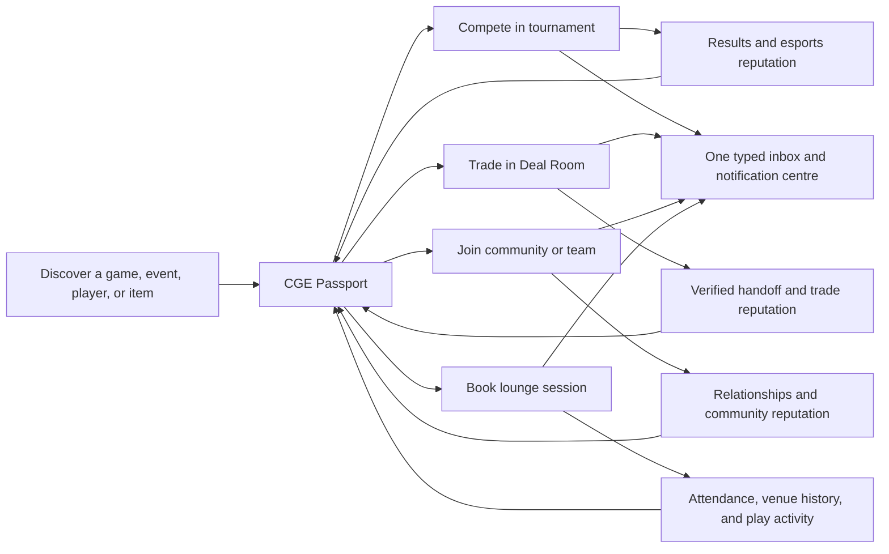

The composite level can be fun, but consequential decisions must use **faceted reputation**. A great Tekken player is not automatically a trustworthy seller; a marketplace dispute should not erase tournament skill. Show separate esports, trade, community, and venue facets, then use a composite CGE Career Level for recognition and gamification.

---

## 1. Homepage, architecture, and first-use experience

### Current state

The homepage is CGE’s strongest public surface. “The gaming platform for Africa,” the four-pillar layout, the three-step introduction, Bonny Island proof, transparent lounge prices, and closed-beta banner make the product understandable. The navigation is conventional and the mobile bottom bar gives frequent destinations enough prominence.

The main weakness is that the homepage promises a living ecosystem while the destination pages often show no activity. It also presents “₦1M+ prize pools hosted” without explaining whether that is historical, current-season, or available now. When the esports page says zero, the claim feels inconsistent rather than cumulative.

### Recommendations

- Add an authenticated **For You** home: upcoming booking, tournament check-in, open swap proposal, unread message, followed organizer update, and nearby activity.
- For signed-out users, show a small “Live on CGE” rail containing only verified current data: next tournament, newest approved swap listing, next lounge opening, and one moderated community thread.
- Replace generic sign-up completion with a two-stage activation flow:
  1. Account: email/social login, name, age eligibility, Nigerian state.
  2. Gaming identity: gamertag, 1–5 games, platform(s), play/trade/lounge intent, optional city and availability.
- Preserve context through authentication. A user who selects a lounge zone or tournament should return to that exact step after sign-in.
- Add global search with typed results: Players, Tournaments, Teams, Listings, Posts, Events, and Venues. Include recent searches and keyboard navigation.
- Use a single notification centre with filters for Competition, Trades, Community, Lounge, and Account.
- Clarify closed-beta access: what can anyone browse, what requires approval, typical approval time, and what beta members are expected to do.

---

## 2. Esports

### Current state: verified live

The esports landing page has strong visual positioning—“Compete. Win. Rise.”—and useful tabs for Tournaments, My Tournaments, Teams, Leaderboard, and Achievements. Search and status filtering are present.

However, the live system reports zero open tournaments, ₦0 prizes hosted, and zero total tournaments, while the rest of the site presents historical tournament proof. Tournaments and Teams use closed-beta empty states. The leaderboard repeats “jumbo asolia” at three ranks with all-zero records. On mobile, the tab bar’s fixed inner width causes the whole document to overflow horizontally.

### What the implementation already contains

The repository is much more advanced than the live screen suggests:

- Solo and team tournament registration, free or paid entry, check-in, and participant management.
- Team creation, captain roles, join requests, and roster workflows.
- Tournament creation with game/platform, date/time, slots, entry fee, prizes, team size, rules, check-in window, stream URL, and bracket type.
- Single- and double-elimination bracket generation and management.
- Match start, report, confirmation, disputes, organizer resolution, and payout/refund primitives.
- Predictions, organizer trust, follows, achievements, and shareable tournament details.

These are meaningful assets. The priority is to make a smaller verified subset work beautifully in production before exposing every control.

### Competitor benchmark

| Product | What it does well | What CGE should adopt | Where CGE can be better |
|---|---|---|---|
| [FACEIT](https://support.faceit.com/hc/en-us/articles/360021771299-Joining-R6S-tournaments) | Game identity, team/solo entry, check-in discipline, readiness states, screening, notifications, and anti-cheat expectations. | Linked game accounts, a pre-tournament readiness checklist, solo-player fill, explicit check-in consequences, entrant screening. | Lighter mobile onboarding, local venue competition, local payments, and community/trade integration. |
| [Battlefy](https://help.battlefy.com/en/collections/1517897-tournament-management) | Deep organizer operations, multiple formats, match dashboard, admin assignment, dispute handling, and bracket control. | Staff roles, per-match admin ownership, evidence-based dispute queue, announcements, and format templates. | An opinionated guided workflow for small Nigerian organizers instead of an enterprise-feeling control surface. |
| [Challengermode](https://support.challengermode.com/en/organizing-tournaments1/brackets-1) | Flexible multi-stage structures, automation, prize operations, and branded competitive Spaces. | Reusable tournament blueprints, group-to-playoff stages, automatic advancement, organizer hubs. | Venue-linked qualifiers, lower operational complexity, local cash/transfer flows, and commerce around a player identity. |
| [start.gg](https://www.start.gg/create) | Event hubs, tournament series, rankings, leagues, and organizer merchandising. | Persistent organizer pages, series/season views, venue events, sponsor inventory, and ranking history. | Mobile-first setup and a cohesive path into community, lounge, and gear. |
| [Toornament](https://help.toornament.com/organizer/manage-your-registrations) | Custom registration fields, permissions, waitlists, stages, standings, payment settings, and participant review. | Waitlist, automatic acceptance rules, custom screening fields, CSV import/export, granular staff permissions. | Curated defaults for common FC/Tekken/MK/COD formats and simpler operator training. |

### Recommended player journey

1. Discover by game, format, date, platform, location/online, entry price, prize, and skill level.
2. See an honest readiness card: registration closes, check-in opens, linked account required, team roster status, rules accepted, payment status.
3. Join solo, with team, or as “looking for team.”
4. Receive a persistent tournament thread with announcements, match schedule, opponent, station/server details, and support.
5. Check in through web, QR at a CGE venue, or an organizer code.
6. Report with score and optional evidence; opponent confirms or opens a dispute.
7. Publish results to the CGE Passport and prompt follow, rematch, community discussion, or related lounge session.

### Recommended organizer journey

- Choose a tested template first: “FC 1v1 single elimination,” “Tekken double elimination,” “Team COD,” or “Venue qualifier.” Advanced customization comes second.
- Show a launch checklist with blockers, warnings, and preview: rules, capacity, payment, staff, check-in, stage, payouts, stream, and support contact.
- Add co-organizer roles: Owner, Admin, Bracket Operator, Match Referee, Finance, and Community Moderator.
- Support waitlist, substitutions, coaches, roster lock, late check-in policy, custom entrant questions, and game-account validation.
- Extend formats to round robin, Swiss, free-for-all, group-to-playoff, and multi-stage series only after single/double elimination is operationally stable.
- Add organizer history: completion rate, dispute response time, payout speed, cancellations, participant ratings, and verified events.
- Provide a tournament operations dashboard that prioritizes exceptions: unconfirmed matches, late check-ins, pending refunds, disputes, and messages requiring response.

### Esports-specific priorities

- **Now:** fix statistics, deduplicate leaderboard rows, seed at least one upcoming and one completed tournament, fix the mobile tab strip, and make player rows open profiles.
- **Next:** expose check-in, notifications, evidence-based disputes, waitlist, staff roles, game identity, and an organizer page.
- **Later:** multi-stage formats, anti-cheat integrations, regional ranking seasons, APIs, and partner-venue circuits.

---

## 3. Marketplace and the Swap differentiator

### Current state: verified live

The public marketplace positioning is excellent: “Swap Market” and “Nigeria • Trade swap sell gaming gear” give CGE a sharper promise than generic classifieds. Filters support Swap, Buy, Sell, nearby/state, local condition language, price, category, and sort.

The problem is existential: the live listing area displays “Couldn't load listings,” a Retry button, and zero listings. A browser console hydration error was also observed during the visit; it should be investigated separately rather than assumed to be the direct cause.

### What the implementation already contains

- Sell, swap, and sell-or-swap listing types.
- “Swap for” text and desired-item tags, optional cash buyout, images, Nigerian location fields, views, saves, and listing status.
- Swap proposals with positive or negative cash adjustment.
- Pending, accepted, declined, in-transit, completed, cancelled, disputed, and expired lifecycle states.
- CGE Lounge, in-person, and shipping handoff methods.
- Swap Assist fee/payment state, tracking, received confirmations, and dispute primitives.
- Reverse-match discovery, seller ratings, trust/verification/premium signals, saved searches, suggestions, recent views, related listings, and chat.

This is the beginning of a real transaction system, not a decorative “swap” filter. It should become the product’s signature workflow.

### Competitor benchmark

| Product | What it does well | Weakness CGE can exploit | CGE move |
|---|---|---|---|
| [Jiji](https://jiji.ng/faq/how-to-buy) | Nigerian liquidity, local discovery, direct chat/call, ratings, and prominent safety education. Its rules recommend public meetings and daylight. | Transactions often resolve off-platform; the item-for-item agreement and completion state are weak. | Keep local familiarity while making the full deal legible and verifiable. |
| [eBay](https://www.ebay.com/help/policies/buyer-protection/ebay-money-back-guarantee-policy?id=4210) | Structured offers, tracking, purchase protection, disputes, and category-specific authentication. | Heavy global-commerce model, fee complexity, and no native swaps. | Offer focused protection for gaming trades without copying eBay’s operational weight. |
| [Facebook Marketplace](https://www.facebook.com/help/2374002556073992) | Huge social reach, messaging, seller profiles, and ratings. | Scams, off-platform payment pressure, and inconsistent purchase protection. | Use gaming-specific verification, inspection, and lounge handoff to establish trust. |
| [Swappa](https://swappa.com/faq/answer/listing-device-criteria) | Device-specific listing criteria, serial/IMEI checks, functional-condition requirements, and manual approval. | Narrow device/geography scope and no item-for-item exchange. | Create gaming-hardware diagnostic templates and verified Swap Stations. |

### Build a Deal Room, not just chat

Messaging should support human negotiation, but the transaction itself needs a shared structured object:

**Deal Room header**

- Item offered by A, item offered by B, and any cash adjustment.
- Condition, included accessories, serial/IMEI where appropriate, and known defects.
- Delivery method, meeting venue, target date, payment method, and who pays fees/shipping.
- Fair-value range and the source/date of the estimate—not a claim that values are guaranteed.
- Proposal version, expiry, and a visible change log.

**Lifecycle**

`Proposed → Countered → Accepted → Inspection/Handoff → Both confirmed → Completed`

Alternate branches: `Expired`, `Cancelled`, `Shipping`, `Disputed`, `Refunded`.

Chat messages should never silently modify terms. Each counteroffer produces a new reviewable version that both parties accept.

### Trust and safety design

- Use category-specific inspection checklists: controller drift, buttons, ports, battery, Wi-Fi, disc drive, HDMI output, overheating, storage, account lock, and included accessories.
- Require proof-of-possession image prompts for higher-risk listings—for example, item plus a generated code and current date.
- Check console/device identifiers where legitimate databases or manufacturer processes allow it; clearly state what is and is not verified.
- Make reviews available only after a verified completion or validated in-person handoff.
- Add report, block, mute, seller response-time, cancellation rate, dispute rate, and resolution history.
- Introduce risk-based friction: new or unusual accounts may face listing limits, additional verification, or on-platform handoff requirements.
- Do not expose exact home coordinates. Use approximate areas until a deal is accepted.
- Make CGE Swap Assist optional but concrete: protected payment/cash adjustment, inspection checklist, tracked delivery or verified venue handoff, support SLA, and dispute evidence.
- Publish a plain-language coverage table explaining exclusions, time limits, evidence requirements, and refund destination.

### Signature opportunity: CGE Swap Stations

Turn CGE lounges and approved partner venues into safe handoff points:

1. Both parties book a free or low-cost 20-minute Swap Station slot.
2. The venue confirms both identities without publishing them to the counterparty.
3. Staff or a self-service checklist validates the item’s agreed tests.
4. Both users scan the same QR handoff code.
5. Protected cash adjustment is released and the deal becomes reviewable.

This creates foot traffic, trust, optional diagnostic revenue, and a moat that Jiji, Facebook, and eBay cannot reproduce quickly.

### Marketplace-specific priorities

- **Now:** repair live loading, establish query/error observability, publish a small set of verified inventory, and keep filters useful even when results are empty.
- **Next:** Deal Room, verified completion, report/block, diagnostic templates, proof of possession, risk controls, and saved-search alerts.
- **Later:** multi-item bundles, intelligent two-way and three-way matching, logistics/insurance, optional custody/escrow through properly structured partners, and price-comparison data.

---

## 4. Community

### Current state

The live feed has a solid topical structure: General, Gaming News, LFG, Clips, Memes, Marketplace, Tournaments, Tech Talk, and Introductions. Search supports posts, `@users`, and `#tags`; sorting includes Recent, Trending, Most Liked, My Posts, and Saved. Community rules are concise and visible.

The public state is empty. The page’s primary title is also an H2 rather than H1, and many mobile topic/filter actions have small hit areas.

The implementation includes posts, images, media embeds, polls, mentions, hashtags, reactions, bookmarks, comments, realtime updates, reporting, blocked words, rate limits, and event/tournament-scoped posts. What is missing from the visible product is a social graph and community structure: following people, a Following feed, persistent groups/clans/spaces, suggested players, and clear routes from conversation to action.

### Competitor benchmark

| Product | What it does well | What to adopt | CGE advantage |
|---|---|---|---|
| [Discord](https://support.discord.com/hc/en-us/articles/11074987197975-Community-Onboarding-FAQ) | Community onboarding, roles, live chat, channels, forum tags, permissions, and AutoMod. | Question-based onboarding, role/game selection, forum tags, newcomer checklist, moderator automation. | Searchable durable content plus direct tournament, trade, and booking actions. |
| [Reddit](https://support.reddithelp.com/hc/en-us/articles/29397982017300-Community-Guide) | Topic depth, post flair, discovery, voting, and mature moderator tooling. | Mandatory topic/flair, wiki/guide areas, removal reasons, mod queue, scheduled posts. | Real gaming identity, local events, verified transactions, and play history. |
| [Steam Community](https://partner.steamgames.com/doc/features/community) | Game hubs that combine discussions, screenshots, guides, activity, groups, trading, and player identity. | Per-game hubs, media/clip surfaces, activity history, presence, and groups. | Cross-platform and Nigeria-first instead of being locked to one game store. |

### Recommendations

- Seed community deliberately with named hosts, not anonymous filler. Each launch game should have a weekly LFG thread, clips prompt, results discussion, gear Q&A, and venue session.
- Add a **Following** feed and make Follow available consistently on profiles, post bylines, leaderboard rows, team pages, and organizer pages.
- Introduce lightweight Spaces for games, cities/venues, teams/clans, and tournament series. Avoid giving every user a fully configurable Discord server; start with structured templates.
- Make LFG actionable: game, platform, mode, skill band, location/online, date/time, mic preference, and “Join/Request.” Successful LFG can create a group thread and optionally a lounge booking.
- Add newcomer onboarding based on selected games and location. Immediately follow relevant game hubs and recommend three active people/spaces, with consent and easy editing.
- Add moderator operations: queue, severity, evidence, removal reason, appeal, repeat-offender view, and response-time targets.
- Prefer positive-quality signals to pure likes: helpful, skilled, funny, trustworthy. Limit how much a single engagement score affects visibility.
- Use rate limits and graduated capabilities for new accounts, similar in principle to [Steam’s restrictions against spam and phishing](https://help.steampowered.com/en/faqs/view/71D3-35C2-AD96-AA3A), without making legitimate new players pay to participate.

---

## 5. Lounge booking

### Current state

The live lounge journey starts well. Users can browse Main PS4, VIP PS5, and VR zones, see capacity and starting price, view opening hours, and scan seven days of availability before signing in. That is transparent and confidence-building.

The gaps appear after selection. The clickable zone cards are not semantic controls; duplicate Continue actions appear in the document in some layouts; group booking and rescheduling are delegated to WhatsApp; and the visible “free reschedule up to 6 hours before” language is not presented alongside the separate cancellation/refund policy. The account dashboard implementation contains bookings and receipts, but the full self-service lifecycle was not anonymously verifiable.

### Relevant benchmark

[Playtomic](https://playerhelp.playtomic.com/hc/en-gb/articles/19831715222929-How-to-book-a-court-or-a-spot-in-a-match-in-your-favourite-Club) combines private reservations with open matches that other players can join. Its booking flow makes date, time, venue, duration, price, payment split, cancellation policy, and review visible before payment. CGE can adapt that model to consoles and venue sessions rather than courts.

### Recommendations

- Keep the current zone-first simplicity, but make selection a proper radio-card group.
- Show a sticky summary with zone, station if relevant, date, start time, duration, players, base price, extras, total, payment option, and policy.
- Support group bookings with invite links and either one payer or split payment. [Playtomic distinguishes owner-paid and split-payment reservations](https://playerhelp.playtomic.com/hc/en-gb/articles/19831958258193-Private-Bookings-vs-Open-Matches); CGE can do the same with clearer fallbacks if a participant fails to pay.
- Add “Open Session”: reserve a seat and allow compatible players to join by game, platform, age band where appropriate, and skill preference.
- Allow in-app reschedule/cancel with the exact refund consequence shown before confirmation. Keep WhatsApp as support, not the primary workflow.
- Add waitlist and notify users when a preferred zone/time opens.
- Offer repeat booking, favourite zone, calendar file/link, QR check-in, directions, accessibility information, equipment list, and arrival guidance.
- Connect tournaments to venue operations: assign stations, open practice slots, reserve finalist stations, and let a player book training for the tournament’s game.
- Build a partner-venue console inventory: console generation, controller count, games installed, internet quality, accessibility, and maintenance status.

### Revenue extensions

- Membership bundles with lounge credits, member pricing, priority slots, and tournament perks.
- Party packages with guests, food/drink, host, decorations, and game rotation.
- Practice packs attached to a tournament registration.
- Verified Swap Station appointments and diagnostic services.
- B2B venue software/commission for partner lounges once the flagship workflow is stable.

---

## 6. Messaging and central chat

### Current state

The repository has a responsive conversation list, realtime messages, unread state, and listing context. The underlying conversation model is tied to `listing_id`, `buyer_id`, and `seller_id`, so it is marketplace chat rather than a platform-wide inbox.

On the live signed-out site, `/messages` redirects to `/?auth=required`, while the mobile Chats item is represented as an inert `#` destination. The user is not shown what they were trying to access or returned to it after authentication.

The message composer also needs accessibility labels, and safety features such as report, block, mute, archive, message requests, and transaction escalation are not prominent.

### Recommended model

Create a generic **Conversation** with:

- `type`: direct, marketplace, swap, tournament, match, team, event, lounge booking, support.
- `context_id`: the listing, proposal, tournament, match, team, event, booking, or ticket.
- participants and roles.
- permissions, moderation state, unread markers, mute/archive state, and retention policy.

Each thread gets a context header and relevant actions. A swap thread shows current deal terms; a match thread shows opponent, schedule, score, and report action; a lounge thread shows time, party, and reschedule; a team thread shows roster and next match.

### Interaction recommendations

- Inbox filters: All, Unread, Trades, Competition, Teams, Lounge, and Support.
- Message requests for people without an existing shared context.
- Search across people and message text, with privacy-appropriate retention.
- Read state, typing state, reply, reaction, image/evidence attachment, link safety, and optional voice note later.
- Thread-level Report, Block, Mute, Archive, and Escalate to CGE.
- Spam controls: new-account limits, unsafe-link warnings, repeated-copy detection, and stronger protection around payment diversion.
- Do not build general voice/video chat initially. Deep-link to Discord/WhatsApp only when needed, while keeping essential deal and competition records on-platform.

Discord and Steam demonstrate why presence, direct/group chat, notifications, and block controls belong together. [Steam’s official Friends & Chat documentation](https://help.steampowered.com/en/faqs/view/595C-42F4-3B66-E02F) is a useful reference for presence, favourites, invitations, group chat, and notification settings; CGE should implement the smaller subset needed to complete its own workflows.

---

## 7. Player profiles and the CGE Passport

### Current state

The public player card is one of the most strategically important elements already present. It combines gamertag, avatar, points, wins/losses, trust and marketplace activity, bio, favourite game, location, tournament and achievement counts, badges, and a composite Rookie-to-Legend career tier.

The account profile, however, is weighted toward marketplace administration. Profile editing appears limited, and there is no clear unified editor for gamertag, bio, multiple games, platform identities, availability, play style, city/venue, privacy, and social links. Public cards do not prominently offer Follow or Message, leaderboard rows do not open player profiles, and “Share my card” is incorrect when viewing another player.

### Recommended profile architecture

**Identity**

- Gamertag, pronunciation/display name, avatar/banner, short bio, city/state at the user’s chosen precision, languages, and availability.
- Favourite games as a ranked list, not one field.
- Platforms and verified external handles: PSN, Xbox, Steam, Epic, Riot, Activision, and others only where useful.
- Looking for: team, scrims, casual play, lounge friends, buying, selling, swapping, coaching.

**Faceted reputation**

- Esports: rank, record, titles, placement history, disputes, no-show/check-in reliability.
- Trade: completed buys/sells/swaps, verified handoffs, ratings, response time, disputes.
- Community: helpful contributions, moderation standing, followed spaces, hosted activities.
- Lounge: sessions attended, host reliability, venue badges—without exposing sensitive visit history by default.

**Career and expression**

- Achievements, seasonal trophies, tournament clips, favourite loadout/gear, teams, events, posts, and customizable showcases.
- Steam’s profile model supports avatars, showcases, badges, games, and granular privacy controls; its [profile help](https://help.steampowered.com/en/wizard/HelpWithSteamIssue?issueid=1002) and [privacy settings](https://help.steampowered.com/en/faqs/view/588C-C67D-0251-C276) are useful references.
- PlayStation makes “played together,” games, trophies, and friend actions discoverable from the player profile, subject to privacy settings. See [PlayStation friend and profile controls](https://www.playstation.com/en-sg/support/account/add-friends/).

**Social actions**

- Follow, message, invite to team, challenge, propose a swap, invite to lounge session, share, report, and block.
- Followers/following lists, mutual connections, and “played/traded with” context.
- Separate one-way Follow from mutual Friend. Use Friend only when both accept.

**Privacy**

- Controls for profile, game identity, presence, city, activity, tournament history, trade history, lounge history, messages, and discoverability.
- Default minors to more private settings and restrict exact location and unsolicited messages.

### The CGE Passport principle

The profile should be portable across every CGE surface, but data should be collected only when it unlocks a real benefit. Progressive profiling is preferable to a long mandatory form: ask for platform identity when joining a relevant tournament, payout verification when winning, and device information when listing that device.

---

## 8. Cross-pillar UX opportunities

These integrations turn CGE from a collection into an ecosystem:

| Trigger | Connected action |
|---|---|
| User registers for a tournament | Offer practice slots for that title, relevant team/LFG posts, and approved gear listings. |
| User wins or places | Update Passport, create a shareable result card, recommend the next event, and open a moderated results thread. |
| User views a gear listing | Show seller’s relevant trade reputation, compatible wanted items, nearby Swap Stations, and gaming communities for the item. |
| Swap is completed | Update trade reputation, prompt a verified review, offer a lounge test session, and close/archive the thread. |
| User books a lounge station | Invite friends, open seats to LFG, add a group thread, and suggest same-day events. |
| User posts an LFG | Convert it into a team, open session, or tournament registration without re-entering details. |
| User follows a game | Personalize tournaments, posts, listings, lounge availability, and notifications for that game. |
| Organizer creates a venue event | Reserve stations, publish schedule, create event community space, attach ticket/registration, and send operational messages. |

Implement these as context-aware next actions, not noisy cross-selling. A player should understand why each recommendation appears and be able to dismiss or tune it.

---

## 9. Mobile, accessibility, performance, and content quality

### Mobile

- Fix esports document overflow; tab rows may scroll internally but must not widen the page.
- Make filters usable as a bottom sheet or horizontally contained chip rail.
- Raise common hit areas to at least 44 px. This includes status filters, sort controls, topic chips, small icon buttons, Retry, and inline support actions.
- Keep the bottom navigation, but show a clear selected state, notification badge, accessible labels, and real destinations.
- Test at 320, 360, 375, 390, 412, and 768 px; with 200% text zoom; and with long Nigerian names and locations.

### Accessibility

- Preserve the existing skip link and reduced-motion behavior.
- Use one H1 per page. Community, Events, and several legal pages currently expose their main title as H2.
- Replace clickable `
` cards with buttons, links, radio groups, or checkboxes as appropriate.
- Label every icon-only action and the chat composer; expose state such as selected, expanded, current, unread, and invalid.
- Avoid nested interactive controls such as a link containing a button.
- Ensure visible keyboard focus and logical modal focus trapping/return.
- Check error contrast, not just default text; connect field errors with `aria-describedby`.
- Caption promotional video and provide pause controls where motion continues.
- Conduct a WCAG 2.2 AA audit with keyboard, screen reader, high zoom, and touch—not only an automated scanner.

### Performance and resilience

- Treat performance as a product requirement for variable mobile connectivity. GSMA’s 2025 reporting notes that Sub-Saharan Africa still has the world’s largest mobile-internet coverage gap; a [data-conscious experience](https://www.gsma.com/somic/wp-content/uploads/2025/09/The-State-of-Mobile-Internet-Connectivity-2025-Overview-Report.pdf) is strategically relevant, not cosmetic.
- Replace repeated raw `` usage with optimized responsive images where appropriate. Lint currently flags many instances.
- Add a user-selectable Data Saver: static hero instead of video, compressed thumbnails, no autoplay, delayed media embeds, and explicit download sizes.
- Server-render or cache critical public inventory and tournaments so an upstream query failure does not leave the core page blank.
- Add skeletons only for short expected waits; after a timeout, show a useful fallback, status reference, and alternative path.
- Instrument Core Web Vitals and route-level error rate by device/network class. Monitor marketplace query success, auth redirects, image failures, and payment webhook latency.
- Make uploads resumable or recoverable; preserve drafted listings/posts locally when connectivity drops.
- Support PWA installation, offline booking receipts/check-in QR, and queued drafts before investing in native apps.

### Copy, policy, and trust

- Separate “platform age 13+” from “lounge attendance rules” to avoid confusion with the venue’s guardian requirements.
- Put the exact cancellation, reschedule, refund, late-arrival, and no-show rules at selection and checkout.
- Relabel past-event “spots” to attendance, registrations, capacity, or “event completed.” A past event showing 0/50 reads as failure.
- State whether all-time prize claims include sponsored, cash, and gear prizes.
- Replace generic errors with specific next steps, while keeping technical detail out of the primary message.
- Make location permission opt-in and explain the benefit before triggering it. Do not show “blocked” during sign-up unless the user actually asks to use current location.

---

## 10. Product prioritization: MoSCoW

### Must have for a credible beta

- Marketplace reliability, monitoring, cached fallback, and real approved inventory.
- One source of truth for esports and event totals; unique leaderboard aggregation.
- Green booking/payment regression suite and idempotent webhook verification.
- Mobile overflow fix, minimum hit areas, semantic zone selection, correct heading hierarchy, and labelled icon controls.
- Auth return paths and a functional Chats destination.
- Seeded tournaments, marketplace listings, community posts, and named hosts/moderators.
- Editable CGE identity: gamertag, avatar, bio, games, platforms, state/city precision, and intent.
- Profile links from leaderboard, teams, posts, listings, and tournament participants.
- Report, block, mute, and escalation controls in chat and marketplace.
- Clear policies at the moment of booking/trading/payment.
- Event analytics and operational telemetry for activation and core workflow failures.

### Should have after stability

- Deal Room with versioned offers, cash adjustment, expiry, inspection, handoff, completion, and dispute.
- Central typed inbox and notification centre.
- Tournament waitlist, custom entrant fields, evidence-based disputes, staff roles, and organizer history.
- Self-service lounge reschedule/cancel, waitlist, calendar, QR check-in, and group/split payment.
- Community Following feed, game/city/venue Spaces, structured LFG, and moderator queue.
- Faceted reputation, verified completion reviews, privacy controls, followers/following, and mutual context.
- Saved-search and followed-game alerts with frequency controls.
- Search across all entity types.

### Could have once network activity is healthy

- Swap Stations and paid diagnostics at CGE/partner lounges.
- Multi-item and intelligent reciprocal swap matching.
- Open lounge sessions that nearby compatible players can join.
- Tournament practice bundles and venue-station assignment.
- Seasonal CGE ranks, shareable career cards, and opt-in quests across pillars.
- Organizer storefronts, series pages, sponsor modules, and venue partner portal.
- Coaching, creator guides, clip challenges, and gear collections.

### Future bets

- Optional protected custody/escrow, insurance, and integrated logistics through compliant partners.
- Cross-border African trade, multi-currency settlement, and market-specific mobile money.
- Anti-cheat and game-account API integrations.
- Nationwide venue franchise/partner operating system.
- Native mobile app after PWA demand and retention justify it.
- External organizer API, white-label competition infrastructure, and portable CGE identity integrations.

---

## 11. Defensible Nigeria/Africa-first opportunities

### 1. SwapGraph

Represent what every user has and wants as structured data. Generate direct matches, item-plus-cash matches, bundles, and eventually multi-party cycles. Explain why a match is recommended and let users hide categories or values.

### 2. Safe Swap Network

Use lounges as trusted inspection/handoff points with QR confirmation, device tests, optional protected cash adjustment, and verified reviews.

### 3. Lounge-to-league circuit

Partner lounges host standardized qualifiers; CGE manages station inventory, check-in, brackets, results, content, and rankings. Winners progress from city/venue events to regional and national finals.

### 4. CGE Passport

One recognizable gaming identity with verified platform handles, achievements, tournament record, trade reputation, teams, community contributions, and venue history—faceted for fairness.

### 5. Low-data and fallback mode

PWA, compressed media, resumable drafts, offline receipts, deferred uploads, and WhatsApp/SMS only as carefully scoped fallbacks for critical reminders. Do not push sensitive deal negotiation off-platform.

### 6. Nigerian gaming condition standard

Create a trusted vocabulary and test protocol for consoles, controllers, accessories, games, and power equipment. Include local-used/foreign-used context, repair history, voltage/power considerations, and evidence prompts.

### 7. Local payment flexibility

Offer card, bank, transfer, and USSD where supported. [Paystack documents cards, Nigerian bank account/transfer, and USSD channels](https://paystack.com/docs/payments/payment-channels/). Make pending states explicit, verify via webhooks, and never treat a screenshot as payment proof.

### 8. “Find my people” graph

Recommendations based on game, platform, location, skill band, play times, tournament history, and shared venue—while giving users clear privacy and control.

---

## 12. Monetization model

Monetize successful outcomes and operational value rather than basic participation.

| Stream | Offer | Guardrail |
|---|---|---|
| Lounge | Session revenue, memberships, party packages, add-ons, practice bundles. | Always show total price and refund terms before payment. |
| Marketplace | Promoted listings, seller subscription, Swap Assist, diagnostics, protected handoff, shipping/insurance referral. | Do not make organic listings invisible or imply protection where none exists. |
| Esports | Organizer fee, paid-entry platform fee, premium operations, sponsored tournaments, branded series. | No pay-to-win ranking; disclose fees and prize funding. |
| CGE+ membership | Lounge credits/discounts, listing boosts, advanced alerts, cosmetic Passport customization, member events. | Core safety, messaging, and fair competition remain free. |
| Venue network | Booking commission or SaaS, qualifier operations, diagnostics, partner analytics. | Standardize service level and display venue-specific policies. |
| Brand/sponsor | Sponsored seasons, placements, creator challenges, anonymized aggregate insights with consent. | Label sponsorship and never sell sensitive location/identity data. |

Avoid launching all streams at once. First prove repeat lounge bookings, completed swaps, and completed tournaments; then charge for protection, convenience, reach, and professional tools.

---

## 13. Phased roadmap

### Phase 1 — Trustworthy beta foundation: 0–6 weeks

**Outcome:** Every promoted public journey works, looks active, and produces trustworthy data.

- Repair marketplace production loading and add route/query health monitoring.
- Unify historical/current esports statistics and deduplicate leaderboard aggregation.
- Fix protected return paths, Chats destination, mobile esports overflow, touch targets, headings, and lounge control semantics.
- Reconcile booking policies and show them in-flow.
- Resolve the Paystack test failure; make tests/lint deployment gates after triage of existing rules.
- Recruit launch hosts: at least two organizers, two community moderators, and a verified listing cohort.
- Publish a small reliable calendar of tournaments and community prompts instead of broad empty promises.
- Add analytics for activation, registration, payment, listing load, proposal, booking, and notification events.
- Add basic profile editor and connect visible names/avatars to player pages.

**Exit criteria**

- Marketplace successful-load rate ≥ 99.5% over seven days.
- No duplicate player rows in production rankings.
- Payment/webhook regression suite fully green and idempotency verified.
- No document overflow at target widths; keyboard completion of lounge zone selection.
- At least one upcoming and one completed tournament visible, verified listings available, and a consistent weekly community cadence.

### Phase 2 — Complete the core loops: 6–16 weeks

**Outcome:** Users can finish a competition, swap, community, or lounge journey without leaving CGE for essential operations.

- Launch versioned Deal Room, verified completion, safety controls, reviews, and saved alerts.
- Generalize conversations into a typed inbox; add notification centre and return-to-context auth.
- Expose tournament check-in, waitlist, evidence disputes, organizer staff roles, and performance history.
- Launch lounge history, self-service reschedule/cancel, calendar, QR check-in, group invite, and waitlist.
- Add Following feed, structured LFG, game/venue Spaces, and moderator queue.
- Launch CGE Passport v1 with facets, games/platforms, privacy, Follow/Message/Invite actions.
- Add universal search.

**Exit criteria**

- ≥ 60% of accepted swap proposals reach verified completion or an explicit resolved terminal state.
- ≥ 85% tournament check-in among paid/confirmed entrants.
- ≥ 70% of booking changes handled self-service.
- Median first response to a new user’s community post under 12 hours during staffed periods.

### Phase 3 — Build the network moat: 4–9 months

**Outcome:** Physical venues, structured reputation, and organizers make CGE harder to substitute.

- Pilot Swap Stations and diagnostic checklists at Bonny Island.
- Launch venue qualifier templates, station assignment, practice bundles, and city/venue ranking seasons.
- Add organizer pages/series, multi-stage formats, custom entrant fields, and verified game identities.
- Introduce partner-venue console inventory and operator dashboard.
- Add open lounge sessions and match-compatible LFG.
- Launch smarter swap matching, fraud/risk operations, and optional protected logistics pilots.
- Introduce CGE+ only after retention and benefit usage are proven.

**Exit criteria**

- Cross-pillar monthly-active rate ≥ 25%: users complete meaningful actions in at least two pillars.
- Swap Station dispute rate materially lower than unmanaged in-person swaps.
- Repeat booking rate and tournament-to-practice conversion demonstrate venue synergy.
- Partner-venue operations meet agreed fulfilment and support SLAs.

### Phase 4 — Scale across Africa: 9–18+ months

**Outcome:** CGE becomes portable infrastructure for gaming communities and venues beyond the flagship market.

- Expand partner venues city by city using service-quality gates.
- Add market-specific currency, payments, logistics, policy, and moderation operations.
- Introduce mobile money where locally supported; do not assume Nigerian methods fit every market.
- Add anti-cheat/game integrations, external organizer API, sponsor/creator tools, and optional white-label infrastructure.
- Evaluate native apps only if PWA cohorts prove persistent mobile engagement and push-notification value.
- Explore compliant custody/escrow and insurance partners after transaction volume justifies the operational burden.

---

## 14. Measurement framework

### North-star metric

**Monthly Ecosystem Participants (MEP-2):** unique users who complete meaningful actions in at least two CGE pillars in a rolling 30-day period.

Examples: tournament check-in + lounge booking; completed swap + community contribution; event attendance + following an organizer. Browsing, page views, and auto-generated notifications do not count.

### Activation

- Account → gaming identity completion.
- First meaningful action within 24 hours and 7 days.
- Time to first relevant tournament/listing/post/slot.
- Auth completion and return-to-intent success.

### Esports

- View → registration; registration → payment; payment → check-in; check-in → completion.
- No-show, dispute, organizer response, payout time, cancellation, and repeat-entry rates.
- Team formation and waitlist-fill rates.

### Marketplace

- Listing approval time, search-to-detail, proposal, counteroffer, acceptance, completion, expiry, cancellation, and dispute rates.
- Time to first qualified proposal; swap-match precision; saved-search reactivation.
- Verified review rate and protected vs unprotected completion outcomes.

### Community and messaging

- New-post first-response time, healthy reply depth, LFG fulfilment, follow conversion, D7/D30 contributor retention.
- Unread resolution, message-request acceptance, report rate, moderation SLA, block rate, and off-platform diversion indicators.

### Lounge

- Slot view → booking, payment success, occupancy, repeat booking, cancellation, no-show, waitlist fill, self-service change, and add-on conversion.

### Quality guardrails

- Route/query error rate, payment reconciliation, webhook latency/idempotency, Core Web Vitals by mobile network/device class, accessibility defects, support contacts per completed action, fraud loss, dispute ageing, and safety incidents.

Do not optimize the homepage for clicks at the expense of completed trusted actions.

---

## 15. Validation plan before broader launch

1. Run five moderated mobile usability sessions with new Nigerian gamers: one tournament, one swap, one lounge booking, one LFG post, and one profile/follow task.
2. Run three organizer dry-runs from creation through check-in, bracket, dispute, payout, and cancellation.
3. Perform a real low-value Swap Station pilot using controlled test items and one deliberately disputed case.
4. Reconcile every Paystack event against booking/tournament/payment state; retry duplicated and out-of-order webhook fixtures.
5. Test on low-end Android hardware and throttled/unstable connections, including interrupted image upload and payment return.
6. Complete keyboard, screen-reader, zoom, touch-target, reduced-motion, and colour-contrast checks.
7. Review moderation and safeguarding with minors, location, direct messages, and public meetups explicitly in scope.
8. Run a content-readiness checklist: every promoted module has current activity, a responsible owner, and an honest empty/failure fallback.

---

## Screenshot evidence from the live review

The following captures were taken from the public site on 8 August 2026. They document states observed during this review and may change after deployment.

### Homepage: strong ecosystem proposition

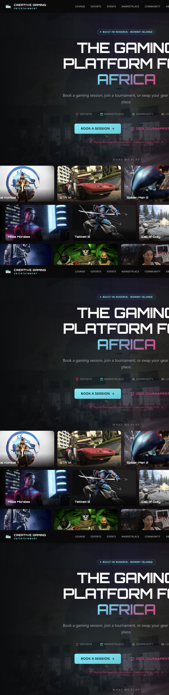

### Lounge: clear zone and price selection

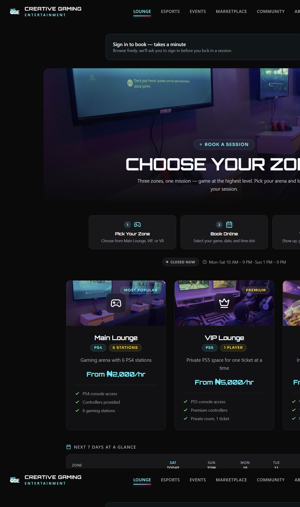

### Authentication and sign-up

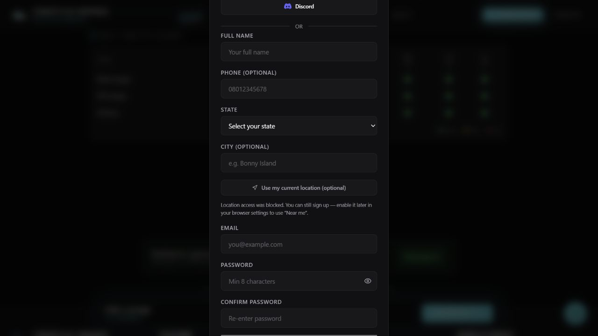

### Esports: polished shell, empty activity and inconsistent statistics

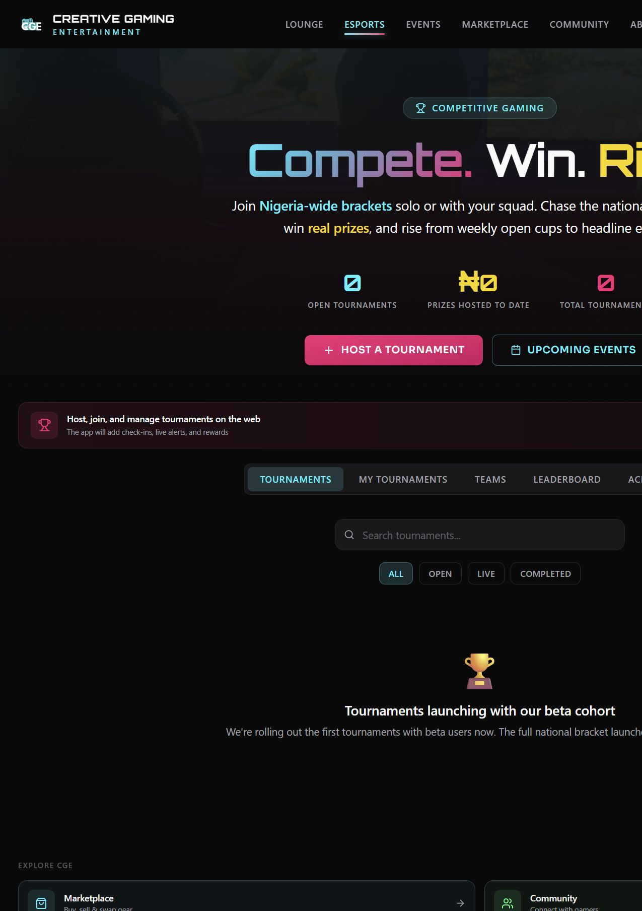

### Marketplace: key public load failure

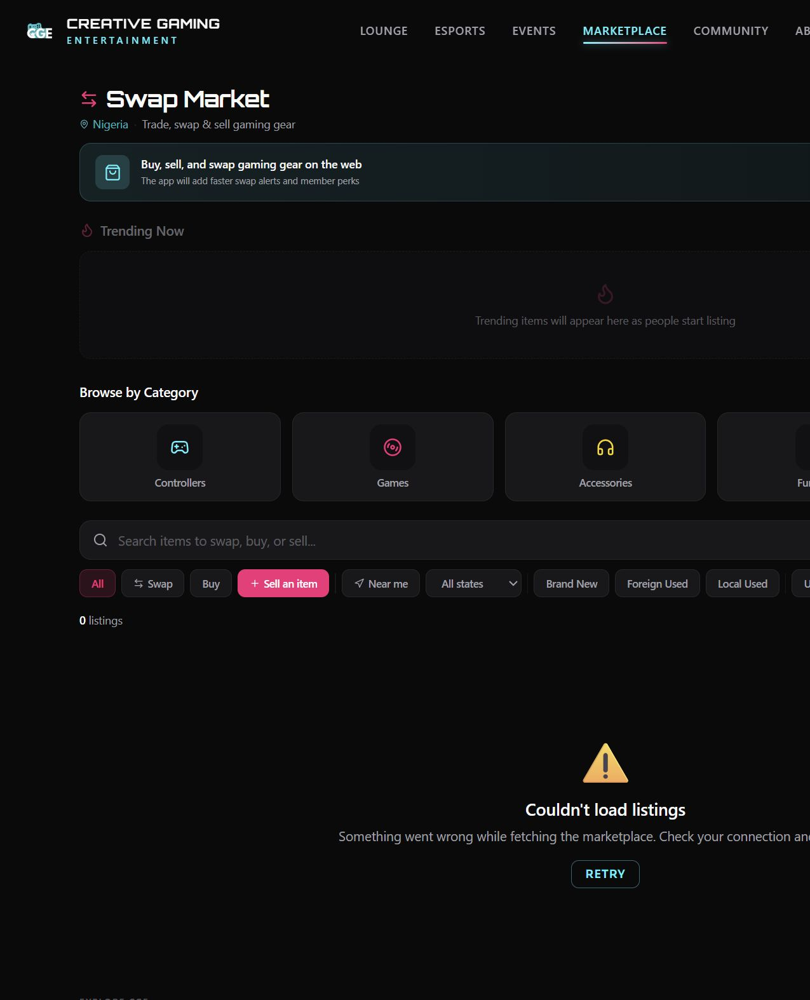

### Community: useful structure but no visible content

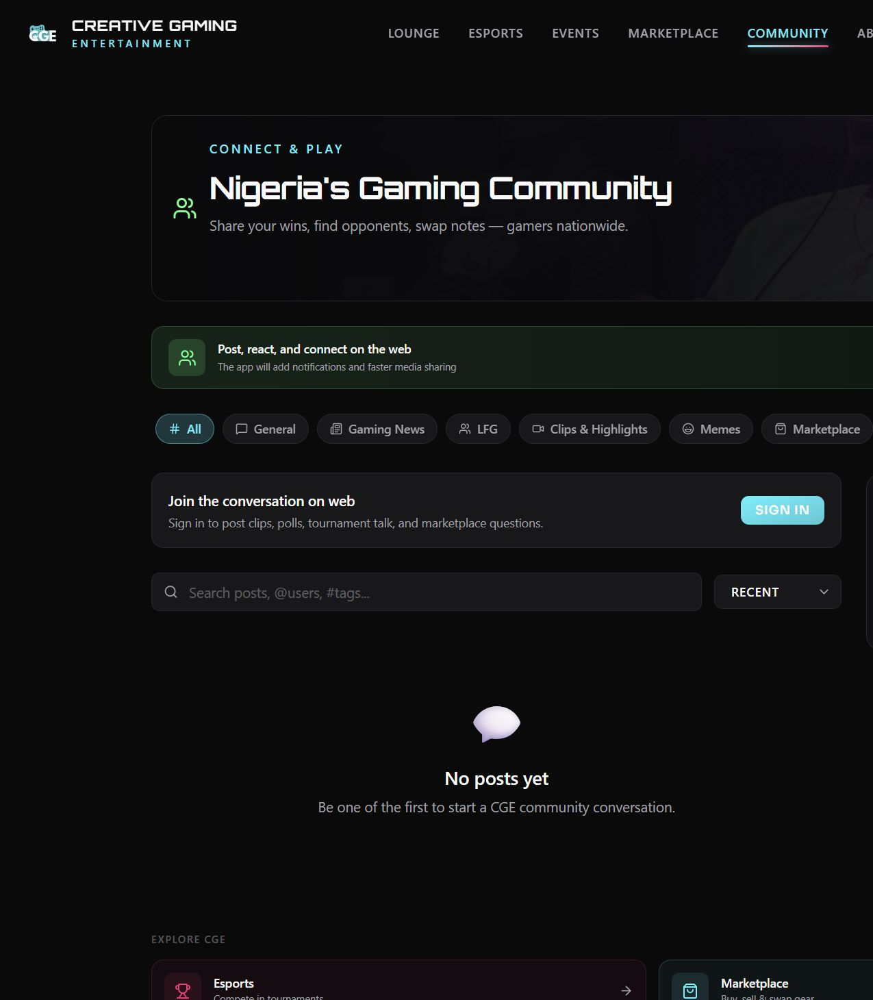

### Events: strongest proof of real-world execution

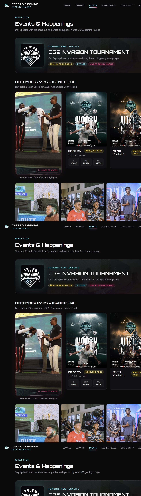

### Mobile homepage

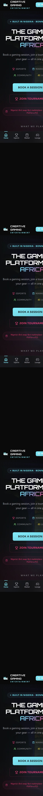

### Mobile lounge

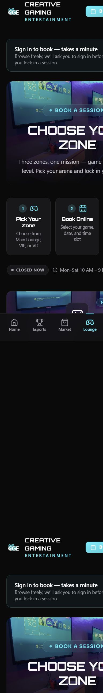

### Mobile marketplace failure

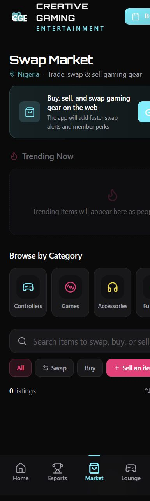

### Mobile esports overflow

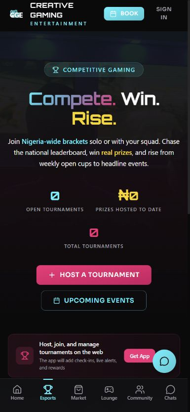

---

## Final product decision

Do not position CGE as “four products in one.” Position it as **one gaming life, with four ways to act**.

The near-term release should be judged by whether a new user can trust what they see, complete one core action, and understand what to do next. The long-term moat will come from structured identity, structured swaps, venue-backed trust, and the way each action improves the next one.

The highest-leverage sequence is:

**reliability and credible activity → complete core loops → one Passport and inbox → venue-backed network effects → regional scale.**

That sequence uses the strongest work already present in the codebase while avoiding the biggest marketplace/community mistake: acquiring users into an empty or unreliable network.
